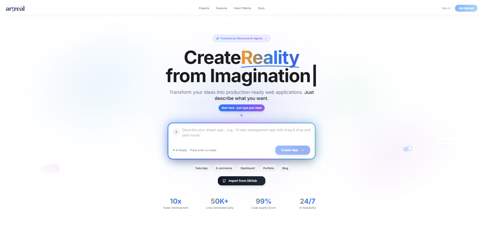
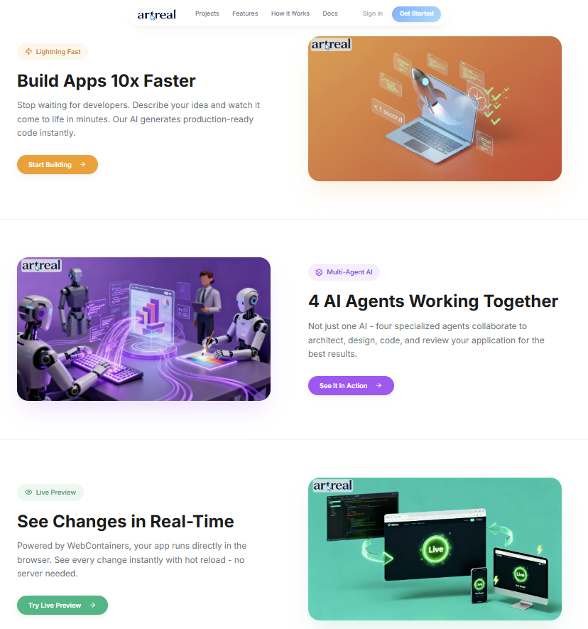
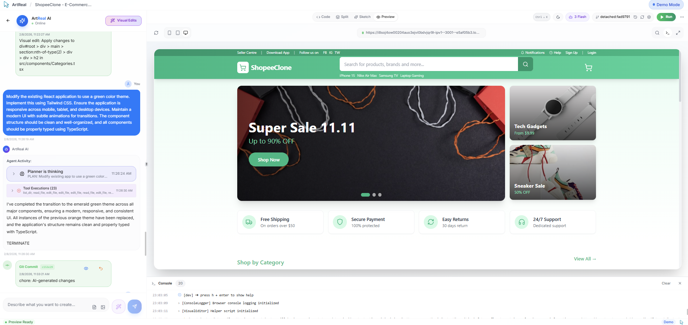
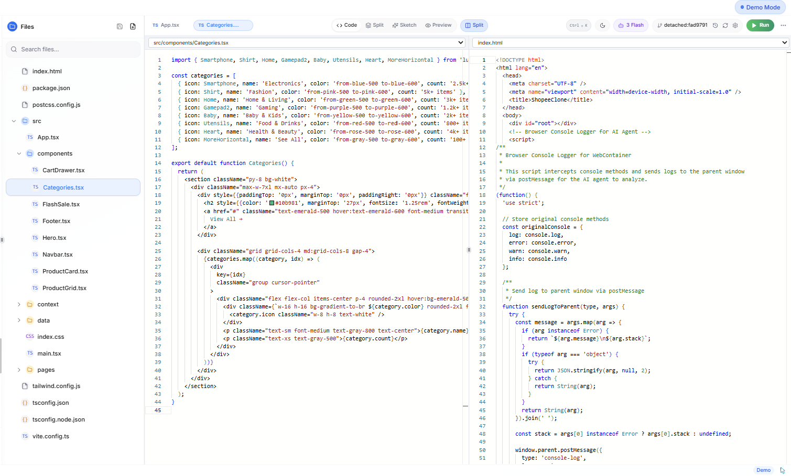
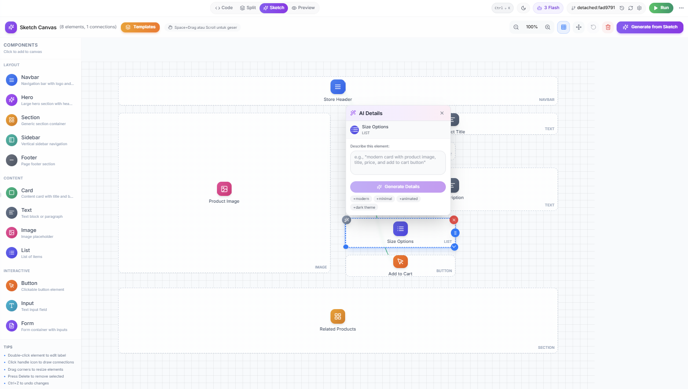
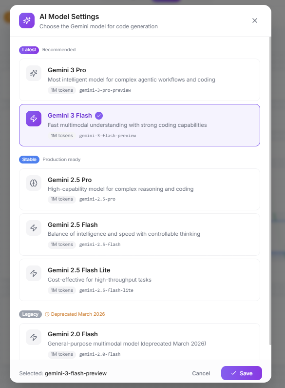
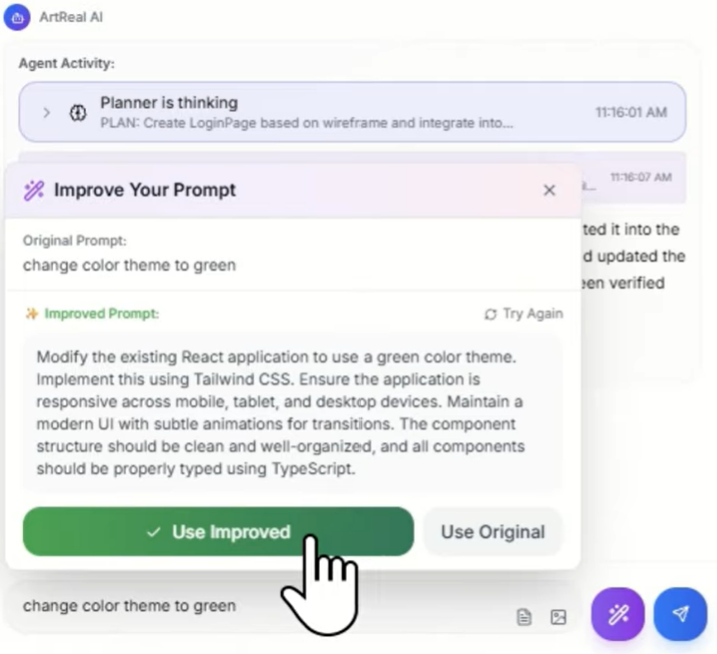
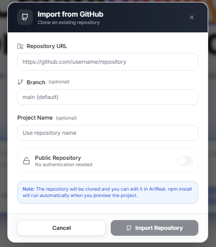

<div align="center">


# ArtReal

### AI-Powered Web Development Platform

**Transform ideas into production-ready React applications using natural language, visual sketching, or image uploads.**

[](LICENSE)
[](https://python.org)
[](https://nodejs.org)
[](https://reactjs.org)
[](https://typescriptlang.org)
[](https://fastapi.tiangolo.com)
[](https://ai.google.dev/)

[Live Demo](#-quick-start) · [Documentation](docs/) · [API Reference](#-api-reference) · [Contributing](#-contributing)

---

### 🎬 Watch Demo

[](https://youtu.be/WqgRO-UH1FY)

**▶️ [Watch the full demo on YouTube](https://youtu.be/WqgRO-UH1FY)**

---



</div>

---

## 🏆 Gemini 3 Global Hackathon

<div align="center">

**Welcome to the era of Gemini 3.**

</div>

Google DeepMind is thrilled to invite you to the **Gemini 3 Global Hackathon**. We are pushing the boundaries of what AI can do by enhancing reasoning capabilities, unlocking multimodal experiences and reducing latency. Now, we want to see what you can create with our most capable and intelligent model family to date.

Whether you are a seasoned AI engineer or writing your first line of code, this is your invitation to build the future. We are looking for more than just another chat interface. We want to see fun, creative, next-generation applications built with the Gemini 3 family.

### Why participate?

| Reason | Description |
|--------|-------------|
| 🚀 **Be First** | Get hands-on access to the Gemini 3 API before the rest of the world catches up |
| 🆕 **Build Something New** | This challenge is strictly for new applications. It's a level playing field for everyone |
| 💰 **Win Big** | Prize pool of **$100,000** + interviews with the AI Futures Fund team for an opportunity to fund your project |

---

## Table of Contents

- [Overview](#-overview)
- [Screenshots](#-screenshots)
- [Key Features](#-key-features)
- [Architecture](#-architecture)
- [Quick Start](#-quick-start)
- [Usage Guide](#-usage-guide)
- [API Reference](#-api-reference)
- [WebContainer Technology](#-webcontainer-technology)
- [AI Agent System](#-ai-agent-system)
- [Keyboard Shortcuts](#-keyboard-shortcuts)
- [Configuration](#-configuration)
- [Deployment](#-deployment)
- [Troubleshooting](#-troubleshooting)
- [Contributing](#-contributing)
- [License](#-license)

---

## Overview

ArtReal is a full-stack AI development platform that revolutionizes how web applications are built. Instead of writing code manually, you can:

- **Chat** with AI to describe what you want
- **Sketch** layouts visually with drag-and-drop components
- **Upload** images, mockups, or PDFs for AI to recreate
- **Edit** directly in the live preview with visual editing mode

The platform generates production-ready **React + TypeScript + Tailwind CSS** code, with real-time preview powered by WebContainers running directly in your browser.

### Why ArtReal?

| Traditional Development | With ArtReal |
|------------------------|--------------|
| Write boilerplate code | Describe in natural language |
| Manual CSS styling | AI generates Tailwind classes |
| Setup build tools | Instant preview, no config |
| Debug layout issues | Visual editing mode |
| Version control setup | Automatic Git commits |

---

## Screenshots

### Landing Page


*Build apps 10x faster with AI-powered development*

### Projects Dashboard


*Manage all your projects in one place*

### AI-Powered Editor


*Chat with AI, edit code, and see live preview - all in one interface*

### Code Editor with Split View


*Full-featured code editor with syntax highlighting and file explorer*

### Visual Sketch to Code


*Draw wireframes and let AI generate the code*

### Gemini 3 Model Selection


*Choose from multiple Gemini 3 models for different use cases*

### Smart Prompt Improvement


*AI helps you write better prompts for better results*

### GitHub Integration


*Import existing repositories or push your projects to GitHub*

---

## Key Features

### 🎨 Multi-Modal Input

<table>
<tr>
<td width="33%">

**💬 Chat Interface**

Describe what you want in plain English. AI understands context and generates clean, maintainable code.

```
"Create a pricing page with
3 tiers: Basic, Pro, Enterprise"
```

</td>
<td width="33%">

**✏️ Visual Sketching**

Drag and drop components on a canvas. Connect elements to show user flow. Click generate.

- Navbar, Hero, Cards, Forms
- Snap-to-grid alignment
- Connection lines
- Real-time preview

</td>
<td width="33%">

**📸 Image Understanding**

Upload screenshots, Figma exports, or PDFs. AI analyzes the design and recreates it in code.

- Screenshot to code
- PDF wireframe parsing
- Figma export support
- Pixel-perfect output

</td>
</tr>
</table>

### 👁️ Live Preview with WebContainers

Your app runs **directly in the browser** - no server needed:

- ⚡ **Instant feedback** - See changes as AI writes code
- 🔥 **Hot Module Replacement** - No page refreshes needed
- 📱 **Device preview** - Test on mobile, tablet, desktop
- 🎨 **Visual editing** - Click elements to edit styles directly

### 🤖 Multi-Agent AI System

Four specialized AI agents collaborate on every request:

| Agent | Role |
|-------|------|
| **Architect** | Plans component structure and data flow |
| **UI Designer** | Creates beautiful, accessible interfaces |
| **Coder** | Writes clean TypeScript/React code |
| **Reviewer** | Checks quality, suggests improvements |

### 🔄 Built-in Version Control

- Automatic Git commits for every AI change
- Visual diff viewer to compare versions
- One-click restore to any previous state
- AI-generated commit messages

### 🎯 Visual Editing Mode

Click any element in the preview to:
- Edit text content inline
- Adjust colors, spacing, typography
- Modify layout properties
- See changes in real-time

---

## Architecture

```
┌─────────────────────────────────────────────────────────────────────┐
│                           FRONTEND                                   │
│  ┌─────────────────────────────────────────────────────────────────┐│
│  │  React 18 + TypeScript + Vite                                   ││
│  │  ┌──────────────┐ ┌──────────────┐ ┌──────────────────────────┐ ││
│  │  │  Chat Panel  │ │ Code Editor  │ │     Preview Panel        │ ││
│  │  │  - AI chat   │ │ - Monaco     │ │  - WebContainers         │ ││
│  │  │  - Streaming │ │ - Syntax     │ │  - Hot reload            │ ││
│  │  │  - History   │ │ - Git diff   │ │  - Device modes          │ ││
│  │  └──────────────┘ └──────────────┘ └──────────────────────────┘ ││
│  └─────────────────────────────────────────────────────────────────┘│
│                              ▼ REST API + SSE                        │
└─────────────────────────────────────────────────────────────────────┘
                               │
┌─────────────────────────────────────────────────────────────────────┐
│                           BACKEND                                    │
│  ┌─────────────────────────────────────────────────────────────────┐│
│  │  FastAPI + Python                                               ││
│  │  ┌──────────────┐ ┌──────────────┐ ┌──────────────────────────┐ ││
│  │  │  API Routes  │ │   Services   │ │    AI Orchestrator       │ ││
│  │  │  - Projects  │ │ - Project    │ │  ┌────────┐ ┌────────┐   │ ││
│  │  │  - Files     │ │ - Chat       │ │  │Planner │ │ Coder  │   │ ││
│  │  │  - Chat      │ │ - Filesystem │ │  └────────┘ └────────┘   │ ││
│  │  │  - Git       │ │ - Git        │ │  Google Gemini API       │ ││
│  │  └──────────────┘ └──────────────┘ └──────────────────────────┘ ││
│  └─────────────────────────────────────────────────────────────────┘│
│                              ▼                                       │
│  ┌─────────────────────────────────────────────────────────────────┐│
│  │  Storage                                                        ││
│  │  ┌──────────────┐ ┌──────────────┐ ┌──────────────────────────┐ ││
│  │  │   SQLite     │ │  Filesystem  │ │    Git Repositories      │ ││
│  │  │  - Metadata  │ │  - Files     │ │  - Version history       │ ││
│  │  │  - Sessions  │ │  - Projects  │ │  - Commits               │ ││
│  │  └──────────────┘ └──────────────┘ └──────────────────────────┘ ││
│  └─────────────────────────────────────────────────────────────────┘│
└─────────────────────────────────────────────────────────────────────┘
```

### Tech Stack

| Layer | Technologies |
|-------|--------------|
| **Frontend** | React 18, TypeScript 5.8, Vite 5.4, Tailwind CSS 3.4, TanStack Query |
| **UI Components** | shadcn/ui, Radix UI, Lucide Icons |
| **Code Editor** | Monaco Editor (VS Code engine) |
| **Preview Runtime** | WebContainers (StackBlitz) |
| **Backend** | Python 3.8+, FastAPI 0.109, SQLAlchemy 2.0 |
| **AI** | Google Gemini API, Microsoft AutoGen |
| **Storage** | SQLite (metadata), Filesystem (code), Git (versioning) |

---

## Quick Start

### Prerequisites

- **Node.js 18+** - [Download](https://nodejs.org/)
- **Python 3.8+** - [Download](https://python.org/)
- **Google AI API Key** - [Get one free](https://aistudio.google.com/apikey)

### Installation

#### 1. Clone the Repository

```bash
git clone https://github.com/mocharil/artreal.git
cd artreal
```

#### 2. Setup Backend

```bash
cd backend

# Create virtual environment
python -m venv venv

# Activate virtual environment
# Windows:
venv\Scripts\activate
# macOS/Linux:
source venv/bin/activate

# Install dependencies
pip install -r requirements.txt

# Configure environment
cp .env.example .env
# Edit .env and add your GOOGLE_API_KEY

# Initialize database
python init_db.py

# Start backend server
python run.py
```

Backend runs at: `http://localhost:8000`

#### 3. Setup Frontend

```bash
cd front

# Install dependencies
npm install

# Start development server
npm run dev
```

Frontend runs at: `http://localhost:8080`

#### 4. Start Building!

Open `http://localhost:8080` in Chrome or Edge (WebContainers requirement).

---

## Usage Guide

### Creating a New Project

1. **From Landing Page**: Type your app idea and click "Generate"
2. **From Projects Page**: Click "New Project" or "Import from GitHub"

### The Editor Interface

```
┌─────────────────────────────────────────────────────────────────┐
│  [←] [Project Name]              [Visual Mode] [Git] [Settings] │
├─────────────┬─────────────────────────┬─────────────────────────┤
│             │                         │                         │
│   Chat      │      Code Editor        │      Live Preview       │
│   Panel     │                         │                         │
│             │  - Multiple tabs        │  - Real-time updates    │
│   - AI      │  - Syntax highlighting  │  - Device modes         │
│   - History │  - Git diff view        │  - Visual editing       │
│   - Images  │  - Auto-save            │  - Console output       │
│             │                         │                         │
├─────────────┴─────────────────────────┴─────────────────────────┤
│  File Explorer                                                   │
└─────────────────────────────────────────────────────────────────┘
```

### Chat with AI

Simply describe what you want:

```
"Create a landing page for a SaaS product"
"Add a dark mode toggle to the header"
"Make the cards grid responsive"
"Fix the button alignment"
```

### Upload Images

1. Click the 📎 attachment button in chat
2. Select an image, screenshot, or PDF
3. Add a description: "Recreate this design"
4. AI will analyze and generate matching code

### Visual Editing Mode

1. Click the "Visual Mode" button in the header
2. Hover over elements in the preview to see outlines
3. Click an element to select it
4. Use the style panel to modify:
   - Colors and backgrounds
   - Spacing and sizing
   - Typography
   - Layout properties

### Version History

1. Click the Git icon in the header
2. Browse commit history
3. Click any commit to preview that version
4. Use "Restore" to revert to a previous state

---

## API Reference

Base URL: `http://localhost:8000/api/v1`

Full interactive documentation: `http://localhost:8000/docs`

### Projects

| Method | Endpoint | Description |
|--------|----------|-------------|
| `GET` | `/projects` | List all projects |
| `POST` | `/projects` | Create new project |
| `GET` | `/projects/{id}` | Get project with files |
| `PUT` | `/projects/{id}` | Update project |
| `DELETE` | `/projects/{id}` | Delete project |
| `GET` | `/projects/{id}/bundle` | Get files for WebContainer |
| `POST` | `/projects/import/github` | Import from GitHub |

### Files

| Method | Endpoint | Description |
|--------|----------|-------------|
| `GET` | `/projects/{id}/files` | List project files |
| `POST` | `/projects/{id}/files` | Create new file |
| `PUT` | `/projects/{id}/files/{file_id}` | Update file |
| `DELETE` | `/projects/{id}/files/{file_id}` | Delete file |

### Chat

| Method | Endpoint | Description |
|--------|----------|-------------|
| `POST` | `/chat/{project_id}` | Send message (non-streaming) |
| `POST` | `/chat/{project_id}/stream` | Send message (SSE streaming) |
| `GET` | `/chat/{project_id}/sessions` | List chat sessions |
| `GET` | `/chat/{project_id}/sessions/{id}` | Get session with messages |
| `DELETE` | `/chat/{project_id}/sessions/{id}` | Delete session |

### Git

| Method | Endpoint | Description |
|--------|----------|-------------|
| `GET` | `/projects/{id}/git/history` | Get commit history |
| `POST` | `/projects/{id}/git/checkout/{hash}` | Checkout commit |
| `POST` | `/projects/{id}/git/checkout-branch` | Return to branch |
| `GET` | `/projects/{id}/git/branch` | Get current branch |

---

## WebContainer Technology

ArtReal uses [WebContainers](https://webcontainers.io/) by StackBlitz to run Node.js directly in the browser.

### How It Works

```
┌─────────────────────────────────────────────────────────────┐
│                      Browser                                 │
│  ┌─────────────────────────────────────────────────────────┐│
│  │              WebContainer (WASM)                        ││
│  │  ┌──────────────┐ ┌──────────────┐ ┌──────────────────┐ ││
│  │  │   Node.js    │ │     npm      │ │   Vite Server   │ ││
│  │  │   Runtime    │ │   Registry   │ │   (HMR)         │ ││
│  │  └──────────────┘ └──────────────┘ └──────────────────┘ ││
│  │                         │                               ││
│  │  ┌──────────────────────────────────────────────────┐   ││
│  │  │              Virtual Filesystem                   │   ││
│  │  │  /src/App.tsx  /package.json  /node_modules/...   │   ││
│  │  └──────────────────────────────────────────────────┘   ││
│  └─────────────────────────────────────────────────────────┘│
└─────────────────────────────────────────────────────────────┘
```

### Benefits

- **No Server Needed** - Everything runs in browser
- **Instant Preview** - Sub-second feedback loop
- **Hot Reload** - See changes without refresh
- **Offline Capable** - Works after initial load
- **Secure** - Sandboxed environment

### Requirements

- **Chrome 89+** or **Edge 89+** (Chromium-based browsers)
- Cross-Origin Isolation headers (configured automatically)

### Smart Caching

ArtReal optimizes WebContainer performance:

- **Dependency caching** - npm packages persist across navigation
- **Instance reuse** - WebContainer stays warm when switching views
- **Auto-fix compatibility** - Automatically handles framework issues

---

## AI Agent System

ArtReal uses a multi-agent architecture for intelligent code generation:

### Agent Workflow

```
User Request
     │
     ▼
┌─────────────┐
│   Planner   │  ← Analyzes request, plans approach
└──────┬──────┘
       │
       ▼
┌─────────────┐
│    Coder    │  ← Generates TypeScript/React code
└──────┬──────┘
       │
       ▼
┌─────────────┐
│   Review    │  ← Validates output, suggests fixes
└──────┬──────┘
       │
       ▼
  Final Code
```

### Capabilities

| Feature | Description |
|---------|-------------|
| **Context Awareness** | Understands existing codebase structure |
| **Multi-file Editing** | Can create/modify multiple files |
| **Error Recovery** | Automatically fixes common issues |
| **Style Consistency** | Maintains project conventions |
| **Incremental Changes** | Modifies only necessary parts |

### Tool Integration

The AI can use built-in tools:

- `create_file` - Create new files
- `edit_file` - Modify existing files
- `delete_file` - Remove files
- `read_file` - Read file contents
- `list_files` - Browse project structure

---

## Keyboard Shortcuts

### Global

| Shortcut | Action |
|----------|--------|
| `Ctrl/Cmd + K` | Open command palette |
| `Ctrl/Cmd + S` | Save current file |
| `Ctrl/Cmd + P` | Quick file search |
| `Ctrl/Cmd + Shift + P` | Command palette |
| `Ctrl/Cmd + B` | Toggle file explorer |

### Chat Panel

| Shortcut | Action |
|----------|--------|
| `Enter` | Send message |
| `Shift + Enter` | New line |
| `Ctrl/Cmd + V` | Paste image |
| `Escape` | Cancel current request |

### Code Editor

| Shortcut | Action |
|----------|--------|
| `Ctrl/Cmd + Z` | Undo |
| `Ctrl/Cmd + Shift + Z` | Redo |
| `Ctrl/Cmd + F` | Find |
| `Ctrl/Cmd + H` | Find and replace |
| `Ctrl/Cmd + /` | Toggle comment |
| `Alt + Up/Down` | Move line |
| `Ctrl/Cmd + D` | Select next occurrence |

### Preview Panel

| Shortcut | Action |
|----------|--------|
| `Ctrl/Cmd + Shift + M` | Toggle mobile view |
| `Ctrl/Cmd + Shift + R` | Refresh preview |
| `Escape` | Exit visual editing mode |

---

## Configuration

### Backend Environment Variables

Create `backend/.env`:

```env
# Required
GOOGLE_API_KEY=your_google_api_key_here

# Optional
DEBUG=True
DATABASE_URL=sqlite:///./artreal.db
SECRET_KEY=your-secret-key-change-in-production

# AI Configuration
AI_MODEL=gemini-2.0-flash
AUTOGEN_MAX_ROUNDS=10

# Server
HOST=0.0.0.0
PORT=8000
```

### Frontend Environment Variables

Create `front/.env.local`:

```env
# API URL (default: http://localhost:8000/api/v1)
VITE_API_URL=http://localhost:8000/api/v1
```

### AI Model Options

ArtReal supports multiple Google Gemini models:

| Model | Best For |
|-------|----------|
| `gemini-2.0-flash` | Fast responses (default) |
| `gemini-2.0-flash-lite` | Faster, lighter responses |
| `gemini-2.5-pro-preview-06-05` | Complex reasoning |

Change model in Settings within the editor.

---

## Deployment

### Production Build

#### Frontend

```bash
cd front
npm run build
# Output in front/dist/
```

#### Backend

```bash
cd backend
pip install gunicorn
gunicorn app.main:app -w 4 -k uvicorn.workers.UvicornWorker
```

### Docker Deployment

```dockerfile
# Dockerfile example coming soon
```

### Environment Considerations

1. **CORS**: Configure allowed origins in `backend/app/main.py`
2. **HTTPS**: Required for WebContainers in production
3. **Headers**: Ensure COOP/COEP headers are set:
   ```
   Cross-Origin-Embedder-Policy: require-corp
   Cross-Origin-Opener-Policy: same-origin
   ```

---

## Troubleshooting

### Common Issues

#### WebContainer fails to start

**Symptoms**: Preview shows "Unable to connect" or blank screen

**Solutions**:
1. Use Chrome or Edge (Safari/Firefox not supported)
2. Disable browser extensions that block WASM
3. Check browser console for CORS errors
4. Clear browser cache and reload

#### AI responses are slow

**Solutions**:
1. Check your API key quota at [Google AI Studio](https://aistudio.google.com/)
2. Switch to a faster model (gemini-2.0-flash-lite)
3. Check backend logs for errors

#### npm install fails in preview

**Symptoms**: "EEXIST" or dependency errors

**Solutions**:
1. Click "Refresh" in preview panel
2. The system auto-retries with cache clearing
3. Check package.json for version conflicts

#### Next.js 15+ shows Turbopack error

**Note**: ArtReal automatically handles this by:
1. Detecting Next.js 15+ projects
2. Downgrading to Next.js 14.2 for WebContainer compatibility
3. Showing a warning banner explaining the fix

Your actual code remains unchanged - only the preview uses the downgraded version.

### Getting Help

1. Check [existing issues](https://github.com/mocharil/artreal/issues)
2. Review backend logs: `tail -f backend/logs/app.log`
3. Check browser console for frontend errors
4. Open a new issue with:
   - Steps to reproduce
   - Browser and OS version
   - Error messages/screenshots

---

## Contributing

We welcome contributions! Here's how to get started:

### Development Setup

1. Fork the repository
2. Create a feature branch: `git checkout -b feature/amazing-feature`
3. Make your changes
4. Run tests (when available)
5. Commit: `git commit -m 'Add amazing feature'`
6. Push: `git push origin feature/amazing-feature`
7. Open a Pull Request

### Code Style

- **Frontend**: ESLint + Prettier (run `npm run lint`)
- **Backend**: Black + isort (run `black . && isort .`)
- **Commits**: Use conventional commits (`feat:`, `fix:`, `docs:`, etc.)

### Areas to Contribute

- [ ] Add more project templates
- [ ] Improve AI prompts
- [ ] Add test coverage
- [ ] Enhance documentation
- [ ] Fix bugs from issues
- [ ] Performance optimizations

---

## Project Structure

```
artreal/
├── frontend/                    # React Application
│   ├── src/
│   │   ├── components/
│   │   │   ├── editor/         # Editor components
│   │   │   │   ├── ChatPanel.tsx
│   │   │   │   ├── CodeEditor.tsx
│   │   │   │   ├── PreviewPanelWithWebContainer.tsx
│   │   │   │   ├── FileExplorer.tsx
│   │   │   │   ├── SketchCanvas.tsx
│   │   │   │   └── ...
│   │   │   └── ui/             # shadcn/ui components
│   │   ├── pages/
│   │   │   ├── Index.tsx       # Landing page
│   │   │   ├── Editor.tsx      # Main editor
│   │   │   ├── Projects.tsx    # Project list
│   │   │   └── Documentation.tsx
│   │   ├── hooks/              # React Query hooks
│   │   ├── services/           # API client
│   │   │   ├── api.ts
│   │   │   └── webcontainer.ts
│   │   └── lib/                # Utilities
│   ├── public/                 # Static assets
│   └── package.json
│
├── backend/                    # FastAPI Application
│   ├── app/
│   │   ├── agents/            # AI agent system
│   │   │   ├── orchestrator.py
│   │   │   └── config.py
│   │   ├── api/               # REST endpoints
│   │   │   ├── projects.py
│   │   │   ├── chat.py
│   │   │   └── settings.py
│   │   ├── services/          # Business logic
│   │   │   ├── project_service.py
│   │   │   ├── chat_service.py
│   │   │   ├── filesystem_service.py
│   │   │   └── git_service.py
│   │   ├── models/            # SQLAlchemy models
│   │   └── main.py            # FastAPI app
│   ├── projects/              # Generated projects
│   ├── requirements.txt
│   └── run.py
│
├── docs/                      # Documentation
│   ├── img/
│   └── ...
│
└── README.md
```

---

## License

MIT License - see [LICENSE](LICENSE) for details.

---

<div align="center">

---

### 🏆 Built for the [Gemini 3 Global Hackathon](https://ai.google.dev/)

**Powered by Google Gemini 3** — The most capable and intelligent AI model family to date.

---

**ArtReal** — *Where Imagination Becomes Code*

[⬆ Back to Top](#artreal)

</div>
